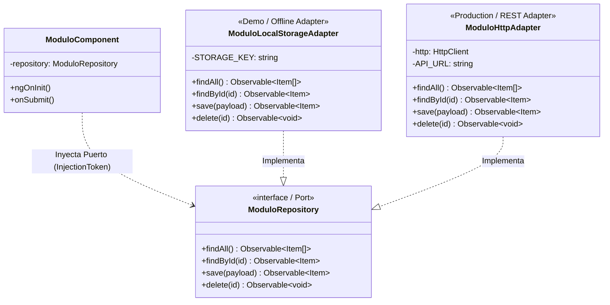

# ADR-001: Aislamiento de Demos y Prototipos mediante LocalStorageAdapter y Patrón Bridge (SDOP)

- **Estado:** Aceptado
- **Fecha:** 2026-09-21
- **Autores:** Arquitecto de Software Principal de SyborX & Equipo 4Guard WMS Frontend
- **Módulos Afectados:** `4Guard_FE_UI/apps/admin-console/src/app/features/*` (Angular 17 Standalone)

---

## 1. Contexto y Problema

Durante el ciclo de desarrollo acelerado de **4Guard WMS**, es habitual construir prototipos interactivos, demos de funcionalidades y flujos offline antes o en paralelo a la disponibilidad de los microservicios en Spring Boot / PostgreSQL.

Históricamente, en algunos módulos (como se evidenció en auditorías de `security-gate.component.ts`), la lógica de simulación, arreglos de datos ficticios (`MOCK_*`) y llamadas directas a `localStorage.getItem()` / `localStorage.setItem()` se incrustaron directamente dentro de los componentes visuales (`.component.ts`).

Esta práctica genera problemas graves de deuda técnica y gobernanza:
1. **Contaminación de la Capa de Presentación:** Los componentes visuales asumen responsabilidades de almacenamiento, parseo JSON, simulación de retrasos y orquestación de datos que no les corresponden.
2. **Refactorización Traumática:** Cuando el backend final está listo, migrar el componente a producción exige reescribir métodos internos del `.component.ts`, rompiendo la UI, alterando bindings y generando regresiones visuales.
3. **Violación del SDOP Framework:** Vulnera el **Pilar 3 (Bridge / Hexagonal)** de la metodología SDOP, que exige desacoplamiento absoluto entre la interfaz de usuario y las fuentes concretas de datos.
4. **Imposibilidad de Pruebas Deterministas:** Dificulta la ejecución del **Oráculo de Pruebas (Pilar 2)** con Playwright en entornos CI/CD sin backend activo.

---

## 2. Opciones Evaluadas

1. **Opción 1: Mocks y LocalStorage embebidos en Componentes Visuales (Anti-patrón)**
   - *Pros:* Rápido de programar en un primer sprint exploratorio.
   - *Contras:* Código fuertemente acoplado; alto riesgo de fugas de datos simulados a producción; refactorización invasiva al conectar APIs reales.

2. **Opción 2: Servicios Híbridos Condicionales (`if (isMock) ... else ...`)**
   - *Pros:* Un solo servicio centraliza la llamada.
   - *Contras:* Servicios sobrecargados con bifurcaciones condicionales y dependencias cruzadas de `HttpClient` y `LocalStorage`; rompe el principio de Responsabilidad Única (SRP) y Open/Closed (OCP).

3. **Opción 3 (Seleccionada): Arquitectura de Puertos y Adaptadores (Bridge Pattern - SDOP)**
   - Desacoplar contrato e implementación mediante una interfaz de repositorio (`[Modulo]Repository`) y proveer dos adaptadores intercambiables:
     - `[Modulo]LocalStorageAdapter` para modo demo, desarrollo offline y tests aislados.
     - `[Modulo]HttpAdapter` para consumo de APIs reales de Spring Boot.
   - Conmutación a nivel de inyección de dependencias mediante **Feature Flags** sin tocar los componentes visuales.

---

## 3. Decisión Tomada

Se establece con carácter **obligatorio y vinculante** la siguiente directiva de arquitectura para todos los módulos existentes y nuevos dentro de `4Guard_FE_UI/apps/admin-console/src/app/features/*`:

### Regla 1: Encapsulamiento Exclusivo en `[Modulo]LocalStorageAdapter`
Todas las demos, prototipos y módulos en fase previa a backend deben implementar su persistencia simulada **exclusivamente** dentro de una clase `[Modulo]LocalStorageAdapter` (ubicada en `features/[modulo]/adapters/` o `features/[modulo]/services/`). Esta clase debe implementar rigurosamente la interfaz contractual `[Modulo]Repository` y retornar flujos reactivos (`Observable<T>` o `Signal<T>`).

### Regla 2: Prohibición Estricta en Componentes Visuales (`.component.ts`)
Queda **estrictamente prohibido**:
- Escribir llamadas a `localStorage` o `sessionStorage` dentro de archivos `.component.ts`.
- Definir constantes de datos mock (`const MOCK_DATA = [...]`) en componentes visuales.
- Ejecutar parseos JSON manuales o mutaciones directas del almacenamiento local en los métodos de la vista.

### Regla 3: Inyección Exclusiva del Puerto Contractual (`[Modulo]Repository`)
Los componentes visuales (`.component.ts`) **únicamente** deben inyectar el token o la abstracción `[Modulo]Repository` (vía `inject([MODULO]_REPOSITORY)` o inyección de interfaz tipada). El componente visual no debe tener conocimiento de si la fuente subyacente es `LocalStorage`, memoria volátil o un servidor HTTP remoto.

### Regla 4: Transición Cero Fricción a Producción vía `[Modulo]HttpAdapter` y Feature Flag
La transición de un módulo desde su fase Demo hacia Producción se realiza **sin modificar una sola línea de los componentes visuales**. El procedimiento estandarizado consiste en:
1. Crear la clase `[Modulo]HttpAdapter` implementando la misma interfaz `[Modulo]Repository` y consumiendo los endpoints REST de `4Guard_BEAPI`.
2. Conmutar el proveedor del token en `app.config.ts` (o en la configuración de rutas lazy) mediante la evaluación de la Feature Flag:
   ```typescript
   environment.dataSource === 'MOCK' || environment.featureFlags?.useMockData
   ```

---

## 4. Diagrama de Arquitectura (Patrón Bridge SDOP)



---

## 5. Código de Referencia Canónico

A continuación se ilustra la implementación canónica que debe seguir cualquier feature (referencia implementada en `features/license-management`):

### 5.1. El Contrato (Port): `features/[modulo]/[modulo].repository.ts`

```typescript
import { InjectionToken } from '@angular/core';
import { Observable } from 'rxjs';
import { SecurityPass, CreatePassDto, ServiceResult } from './[modulo].models';

export interface SecurityRepository {
  getPasses(): Observable<ServiceResult<SecurityPass[]>>;
  getPassById(id: string): Observable<ServiceResult<SecurityPass>>;
  createPass(dto: CreatePassDto): Observable<ServiceResult<SecurityPass>>;
  registerExit(id: string, notes?: string): Observable<ServiceResult<SecurityPass>>;
}

export const SECURITY_REPOSITORY = new InjectionToken<SecurityRepository>('SECURITY_REPOSITORY');
```

### 5.2. El Adaptador Demo: `features/[modulo]/adapters/security-local-storage.adapter.ts`

```typescript
import { Injectable } from '@angular/core';
import { Observable, of } from 'rxjs';
import { delay } from 'rxjs/operators';
import { SecurityRepository } from '../security.repository';
import { SecurityPass, CreatePassDto, ServiceResult } from '../security.models';

@Injectable({
  providedIn: 'root'
})
export class SecurityLocalStorageAdapter implements SecurityRepository {
  private readonly STORAGE_KEY = '4guard_demo_security_passes';

  private loadFromStorage(): SecurityPass[] {
    const raw = localStorage.getItem(this.STORAGE_KEY);
    return raw ? JSON.parse(raw) : [];
  }

  private saveToStorage(data: SecurityPass[]): void {
    localStorage.setItem(this.STORAGE_KEY, JSON.stringify(data));
  }

  getPasses(): Observable<ServiceResult<SecurityPass[]>> {
    const passes = this.loadFromStorage();
    return of({ success: true, data: passes }).pipe(delay(100));
  }

  getPassById(id: string): Observable<ServiceResult<SecurityPass>> {
    const passes = this.loadFromStorage();
    const pass = passes.find(p => p.id === id);
    return of({
      success: !!pass,
      data: pass as SecurityPass,
      message: pass ? undefined : 'Pase no encontrado en LocalStorage'
    }).pipe(delay(50));
  }

  createPass(dto: CreatePassDto): Observable<ServiceResult<SecurityPass>> {
    const passes = this.loadFromStorage();
    const newPass: SecurityPass = {
      id: `sec-mock-${Date.now()}`,
      ...dto,
      createdAt: new Date().toISOString(),
      status: 'ACTIVE'
    };
    passes.unshift(newPass);
    this.saveToStorage(passes);
    return of({ success: true, data: newPass }).pipe(delay(150));
  }

  registerExit(id: string, notes?: string): Observable<ServiceResult<SecurityPass>> {
    const passes = this.loadFromStorage();
    const index = passes.findIndex(p => p.id === id);
    if (index === -1) {
      return of({ success: false, data: undefined as any, message: 'Pase inexistente' });
    }
    passes[index] = {
      ...passes[index],
      status: 'COMPLETED',
      exitedAt: new Date().toISOString(),
      exitNotes: notes
    };
    this.saveToStorage(passes);
    return of({ success: true, data: passes[index] }).pipe(delay(100));
  }
}
```

### 5.3. El Adaptador de Producción: `features/[modulo]/adapters/security-http.adapter.ts`

```typescript
import { Injectable, inject } from '@angular/core';
import { HttpClient } from '@angular/common/http';
import { Observable } from 'rxjs';
import { map } from 'rxjs/operators';
import { environment } from '../../../../environments/environment';
import { SecurityRepository } from '../security.repository';
import { SecurityPass, CreatePassDto, ServiceResult } from '../security.models';

@Injectable({
  providedIn: 'root'
})
export class SecurityHttpAdapter implements SecurityRepository {
  private readonly http = inject(HttpClient);
  private readonly baseUrl = `${environment.apiUrl}/api/v1/security`;

  getPasses(): Observable<ServiceResult<SecurityPass[]>> {
    return this.http.get<ServiceResult<SecurityPass[]>>(`${this.baseUrl}/passes`);
  }

  getPassById(id: string): Observable<ServiceResult<SecurityPass>> {
    return this.http.get<ServiceResult<SecurityPass>>(`${this.baseUrl}/passes/${id}`);
  }

  createPass(dto: CreatePassDto): Observable<ServiceResult<SecurityPass>> {
    return this.http.post<ServiceResult<SecurityPass>>(`${this.baseUrl}/passes`, dto);
  }

  registerExit(id: string, notes?: string): Observable<ServiceResult<SecurityPass>> {
    return this.http.put<ServiceResult<SecurityPass>>(`${this.baseUrl}/passes/${id}/exit`, { notes });
  }
}
```

### 5.4. El Componente Visual Desacoplado: `features/[modulo]/[modulo].component.ts`

```typescript
import { Component, OnInit, inject, signal } from '@angular/core';
import { CommonModule } from '@angular/common';
import { SECURITY_REPOSITORY } from './security.repository';
import { SecurityPass } from './security.models';

@Component({
  selector: 'app-security-gate',
  standalone: true,
  imports: [CommonModule],
  templateUrl: './security-gate.component.html'
})
export class SecurityGateComponent implements OnInit {
  // Inyección limpia del Puerto Abstracto
  private readonly securityRepo = inject(SECURITY_REPOSITORY);

  readonly passes = signal<SecurityPass[]>([]);
  readonly loading = signal<boolean>(false);

  ngOnInit(): void {
    this.loadPasses();
  }

  loadPasses(): void {
    this.loading.set(true);
    this.securityRepo.getPasses().subscribe({
      next: (res) => {
        if (res.success && res.data) {
          this.passes.set(res.data);
        }
        this.loading.set(false);
      },
      error: () => this.loading.set(false)
    });
  }
}
```

### 5.5. Conmutación Dinámica en `app.config.ts` (Feature Flag Bridge)

```typescript
// En app.config.ts
import { SECURITY_REPOSITORY } from './features/security/security.repository';
import { SecurityLocalStorageAdapter } from './features/security/adapters/security-local-storage.adapter';
import { SecurityHttpAdapter } from './features/security/adapters/security-http.adapter';

export const appConfig: ApplicationConfig = {
  providers: [
    // ... otros proveedores globales
    {
      provide: SECURITY_REPOSITORY,
      useFactory: () => {
        const useMock = environment.dataSource === 'MOCK' || environment.featureFlags?.useMockData;
        return useMock ? inject(SecurityLocalStorageAdapter) : inject(SecurityHttpAdapter);
      }
    }
  ]
};
```

---

## 6. Consecuencias

### Positivas
- **Cero Refactorización de Vistas:** El paso de Demo a Producción tiene un costo de refactorización visual de **0 horas** y **0 líneas modificadas en templates y componentes**.
- **Autonomía Total Frontend:** Los equipos pueden maquetar y validar con usuarios finales flujos complejos con persistencia funcional en `localStorage` antes de que el backend empiece a construirse.
- **Auditoría Limpia (SDOP):** El código cumple con las directivas de arquitectura limpia, facilitando la validación del Oráculo de Pruebas (Playwright) tanto en modo mock offline como en entornos de staging.
- **Prevención de Regresiones:** El contrato (`Repository`) garantiza que el backend y el frontend acuerden la misma firma de datos y tipos.

### Negativas / Compromisos
- **Disciplina Previa:** Obliga a crear la interfaz y el modelo antes de implementar la UI (alineado con la filosofía *Spec-Driven*).
- **Sobrecarga Inicial Mínima:** Requiere crear dos archivos de adaptador en lugar de un servicio ad-hoc improvisado.

---

## 7. Notas de Auditoría y Verificación

Para garantizar el cumplimiento de esta directiva en code reviews y agentes de IA:

1. **Checklist de Code Review:**
   - [ ] ¿El archivo `*.component.ts` contiene referencias a `localStorage` o `sessionStorage`? -> **RECHAZADO**.
   - [ ] ¿El archivo `*.component.ts` contiene arreglos de objetos estáticos como datos de prueba? -> **RECHAZADO**.
   - [ ] ¿El componente inyecta `HttpClient` directamente? -> **RECHAZADO**.
   - [ ] ¿Existe un `[Modulo]LocalStorageAdapter` implementando `[Modulo]Repository`? -> **APROBADO**.
   - [ ] ¿El proveedor se conmuta mediante Feature Flag sin bifurcaciones en el componente? -> **APROBADO**.

2. **Verificación Automatizada por Linter:**
   Se añade regla en ESLint para impedir el uso de variables globales de almacenamiento en componentes de features:
   ```json
   {
     "files": ["apps/admin-console/src/app/features/**/*.component.ts"],
     "rules": {
       "no-restricted-globals": [
         "error",
         { "name": "localStorage", "message": "Prohibido el uso de localStorage en componentes visuales (ADR-001-internal-demo-adapters)." },
         { "name": "sessionStorage", "message": "Prohibido el uso de sessionStorage en componentes visuales (ADR-001-internal-demo-adapters)." }
       ]
     }
   }
   ```
