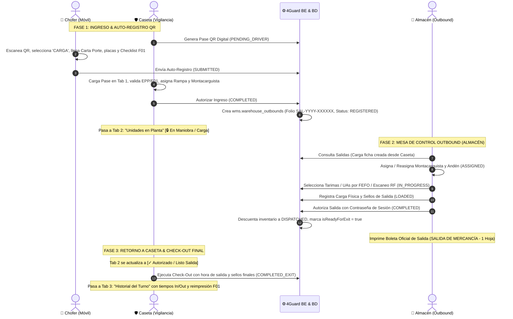

# ADR-019: Flujo Operativo Integral Unificado de Salidas de Almacén (Carga / Despacho Outbound), Mesa de Control WMS y Check-Out en Caseta

- **Estado:** Aceptado / En Implementación
- **Fecha:** 2026-09-17
- **Autores:** Equipo de Arquitectura e Ingeniería 4GUARD WMS (Frontend, Backend, Seguridad Patrimonial & Operaciones)
- **Módulos Afectados:**
  - `apps/admin-console/src/app/features/security/security-gate`
  - `apps/admin-console/src/app/features/warehouse-movements/pages/outbound-submodule`
  - `apps/admin-console/src/app/features/warehouse-movements/components/print-layouts`
  - `4guard_be/src/main/java/com/fourguard/wms/application/usecase/WarehouseOutboundService.java`
  - `4guard_be/src/main/java/com/fourguard/wms/application/usecase/SecurityGateService.java`
  - `wms.security_pre_checkins`, `wms.warehouse_outbounds`, `wms.warehouse_outbound_items`, `wms.inventory_items`, `wms.inventory_movements`, `wms.audit_logs`
- **ADRs Relacionados:**
  - [ADR-015 (Motor Documental PDF & ZPL)](./ADR-015-motor-documental-pdf-zpl-export.md)
  - [ADR-016 (Despacho Multi-Producto y Trazabilidad de Tarimas)](./ADR-016-outbound-multiproduct-pallet-traceability-and-lifecycle.md)
  - [ADR-017 (Auto-Registro Bimodal QR Chofer)](./ADR-017-bimodal-security-gate-qr-driver-self-registration.md)
  - [ADR-018 (Check-Out Caseta y Formato F01)](./ADR-018-security-gate-checkout-and-f01-transport-checklist-homologation.md)

---

## 1. Contexto y Problema Operativo

Anteriormente existía una desconexión entre la vigilancia de caseta y las mesas de control en almacén:
1. **Redundancia de Pre-Salida / Pre-Recepción:**
   El módulo de salidas contaba con flujos manuales aislados de "pre-creación", requiriendo re-capturar datos del transportista, chofer, placas, sellos y rampa que ya habían sido verificados al ingreso vehicular en caseta.
2. **Riesgo de Despachos sin Check-In Legal:**
   Se podían iniciar maniobras de carga en andén sin el soporte de la inspección física obligatoria de seguridad patrimonial (**Formato F01-PO-CP-7.1.3-03**).
3. **Falta de Candado Operativo en Salida de Planta:**
   No existía un candado digital que impidiera al transportista retirarse de las instalaciones si la salida no había sido autorizada y cerrada formalmente por el supervisor de almacén.

---

## 2. Decisión de Arquitectura y Flujo Unificado

Se establece un **Flujo Operativo Cerrado de 3 Fases Homologadas** para todas las operaciones de **Salida / Despacho (Carga)**:

---

## 3. Especificación Detallada por Fases

### 3.1 Fase 1: Caseta de Vigilancia (Auto-Registro QR & Creación de Salida)
- **Tipo de Operación:** `operacion = 'CARGA'`.
- **Campos Requeridos Dinámicos:** Se exige `noCartaPorte` y se inhabilita `remision` de entrada.
- **Creación Automática:** Al presionar `Autorizar Ingreso y Asignar Rampa`, `SecurityGateService` invoca `WarehouseOutboundUseCase.createOutbound(...)`:
  - Genera el folio inmutable `SAL-YYYY-XXXXXX`.
  - Registra transportista, placas de tracto y caja, no. económico, sellos, chofer, cliente, destino y rampa.
  - El pase vehicular se guarda con `status = 'COMPLETED'` y entra a la **Pestaña 2 (Unidades en Planta)**.

### 3.2 Fase 2: Mesa de Control de Salidas WMS (`outbound-submodule`)
La pantalla de salidas se homologa a la experiencia de Recepción:
1. **Eliminación de Pre-Salida:** El listado maestro muestra directamente las salidas registradas desde Caseta (`REGISTERED`).
2. **Reorganización UI/UX:**
   - Botones de acción principales (`Guardar Ajustes`, `Aprobar Despacho Oficial`) ubicados inmediatamente después de la tabla de tarimas.
   - Línea de auditoría (`MovementAuditTimeline`) alojada en un acordeón colapsable bajo demanda para evitar scrolls innecesarios.
   - Bloqueo de modificación de ficha de Caseta una vez que la orden supera el estado `REGISTERED`.
   - Botón `[Cambiar Remisión / Carta Porte]` disponible en cualquier momento (incluso en estado `COMPLETED`).
   - Modal de autorización de despacho solicita credenciales con campos de usuario y contraseña en blanco.
3. **Cierre y Emisión Documental:**
   - La autorización descuenta las UAs del stock disponible a `DISPATCHED` y registra los movimientos en el Kardex.
   - Setea `isReadyForExit = true` en el pase de caseta asociado.
   - Emite la **Boleta Oficial de Salida de Mercancía** (`PrintDispatchLayoutComponent`) homologada al estándar corporativo de 1 sola página.

### 3.3 Fase 3: Retorno a Caseta & Check-Out de Salida
1. **Candado de Seguridad:** En la Pestaña 2 de Caseta, el botón `[Check-Out]` permanece bloqueado (`🔒 En Carga`) hasta que el almacén finaliza la salida (`COMPLETED`).
2. **Registro de Salida:** El guardia captura la `Hora de Salida`, sellos finales y observaciones, transicionando el pase a `COMPLETED_EXIT`.
3. **Historial Limpio:** El pase pasa a la **Pestaña 3 (Historial del Turno)**, mostrando las marcas temporales `In: HH:mm:ss` y `Out: HH:mm:ss` para cálculo de tiempos de estancia y auditoría.

---

## 4. Consecuencias y Beneficios

### Positivas
- **Cero Capturas Duplicadas:** Los datos vehiculares y de transporte viajan intactos desde el smartphone del chofer hasta la boleta final de salida.
- **Blindaje Patrimonial:** Ninguna unidad puede salir de planta sin la doble validación: Checklist F01 (Caseta) + Autorización de Despacho (Almacén).
- **Consistencia UI/UX:** El operador y supervisor disfrutan del mismo flujo ergonómico en Recepciones y en Salidas.

### Cumplimiento
- Compatible con Spring Boot 3, Angular 17+ Signals, arquitectura hexagonal y motor de auditoría inmutable.
