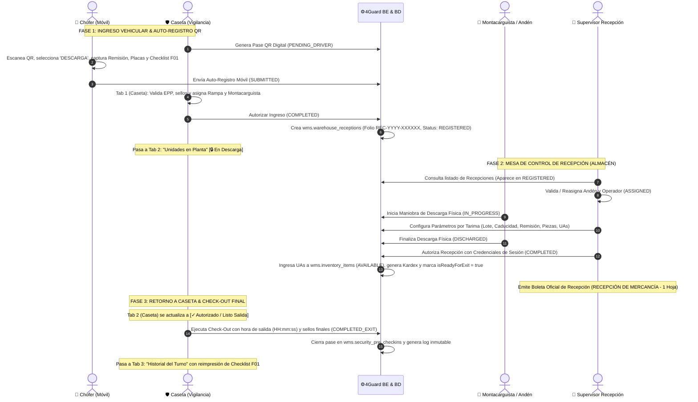

# ADR-020: Flujo Operativo Integral Unificado de Recepción de Almacén (Descarga / Inbound), Mesa de Control WMS y Check-Out en Caseta

- **Estado:** Aceptado / En Producción
- **Fecha:** 2026-09-17
- **Autores:** Equipo de Arquitectura e Ingeniería 4GUARD WMS (Frontend, Backend, Seguridad Patrimonial & Mesa de Control)
- **Módulos Afectados:**
  - `apps/admin-console/src/app/features/security/security-gate`
  - `apps/admin-console/src/app/features/warehouse-movements/pages/receiving-submodule`
  - `apps/admin-console/src/app/features/warehouse-movements/components/print-layouts`
  - `4guard_be/src/main/java/com/fourguard/wms/application/usecase/SecurityGateService.java`
  - `4guard_be/src/main/java/com/fourguard/wms/application/usecase/WarehouseReceptionService.java`
  - `wms.security_pre_checkins`, `wms.warehouse_receptions`, `wms.warehouse_reception_pallets`, `wms.inventory_items`, `wms.inventory_movements`, `wms.audit_logs`
- **ADRs Relacionados:**
  - [ADR-015 (Motor Documental PDF & ZPL - Estándar 1 Hoja)](./ADR-015-motor-documental-pdf-zpl-export.md)
  - [ADR-017 (Caseta Bimodal y Auto-Registro QR Chofer)](./ADR-017-bimodal-security-gate-qr-driver-self-registration.md)
  - [ADR-018 (Check-Out Caseta y Formato Oficial F01-PO-CP-7.1.3-03)](./ADR-018-security-gate-checkout-and-f01-transport-checklist-homologation.md)
  - [ADR-019 (Flujo Integral Salidas de Almacén y Despacho)](./ADR-019-flujo-integral-salidas-almacen-caseta-y-despacho.md)

---

## 1. Contexto y Objetivos Operativos

El proceso de Recepción de Mercancías (Inbound / Descarga) es el punto crítico de ingreso de inventario al centro de distribución. Anteriormente, la operación sufría de fricciones y riesgos:
1. **Doble Captura (Pre-Recepción vs. Caseta):**
   El personal de almacén recapturaba datos de transportista, placas, chofer y sellos que el guardia ya había validado al ingreso.
2. **Inconsistencia en Datos de Tarimas (UAs):**
   Las remisiones con múltiples tarimas presentaban desajustes de piezas, lotes y fechas de caducidad si los parámetros no se capturaban de manera granular e inmutable por cada tarima física descargada.
3. **Ergonomía de Mesa de Control:**
   Los botones de autorización quedaban ocultos tras extensas líneas de auditoría temporal, y no existía la flexibilidad de corregir el número de remisión fiscal tras la descarga sin invalidar la auditoría.
4. **Fuga de Unidades sin Check-Out:**
   Los vehículos descargados salían de las instalaciones sin registrar formalmente su hora de salida (`departureTime`) ni emitir el Checklist oficial de transporte (`F01-PO-CP-7.1.3-03`).

---

## 2. Decisión de Arquitectura: Ciclo Operativo Cerrado de 3 Fases

Se formaliza el **Flujo Integral de Recepción en 3 Fases**, eliminando la "pre-recepción" manual y garantizando la sincronización en tiempo real entre Caseta, Andén, Mesa de Control y Kardex:

---

## 3. Especificación Detallada por Fases y Reglas de Negocio

### 3.1 Fase 1: Caseta de Seguridad & Auto-Registro QR
1. **Generación del Pase:** El guardia genera un código QR bimodal.
2. **Auto-Registro Chofer:** El transportista selecciona `DESCARGA`, registra No. de Remisión del proveedor, línea transportista, placas, dimensiones, sellos de origen y firma digital.
3. **Inspección y Asignación:** El guardia valida EPP, revisión de la caja y asigna Rampa (1 a 12) y Montacarguista.
4. **Disparo Backend:**
   - Al completar el pase (`POST /api/v1/security-gate/passes/{token}/complete`), `SecurityGateService` invoca `WarehouseReceptionUseCase.createReception(...)`.
   - Se genera el folio `REC-YYYY-XXXXXX` con `status = 'REGISTERED'`.
   - La unidad ingresa a la **Pestaña 2 (Unidades en Planta)** de Caseta con candado `🔒 En Descarga`.

---

### 3.2 Fase 2: Mesa de Control de Recepción (`receiving-submodule`)
1. **Cero Pre-Recepción:**
   - El supervisor de almacén abre la pantalla de Recepción y visualiza directamente el arribo en estatus `REGISTERED`.
   - El botón `[Nuevo Arribo]` redirige limpiamente a Caseta (`/security`), evitando formularios redundantes.
2. **Ciclo de Estados en Andén:**
   - `REGISTERED`: Unidad ingresada a planta, rampa asignada.
   - `ASSIGNED`: Montacarguista y andén confirmados por almacén.
   - `IN_PROGRESS`: Descarga física en curso y captura de tarimas.
   - `DISCHARGED`: Descarga física concluida por el montacarguista.
   - `COMPLETED`: Recepción autorizada por el supervisor; inventario ingresado al sistema.
3. **Captura Granular de Parámetros por Tarima:**
   - Cada tarima física (UA) cuenta con su propio lote, fecha de caducidad, piezas y remisión.
   - Se valida que la fecha de caducidad no sea igual o anterior a la fecha de elaboración/fabricación.
   - Si una remisión contiene múltiples tarimas con distintos lotes, la suma de piezas y peso bruto se calcula en tiempo real.
4. **Ergonomía UI/UX:**
   - **Bloqueo de Ficha:** El botón `[Modificar Ficha]` solo es accesible cuando el estatus es `REGISTERED`. Una vez iniciada la descarga (`IN_PROGRESS` en adelante), la ficha queda protegida contra manipulaciones.
   - **Ubicación de Botones:** Los botones de acción (`[Guardar Ajustes]`, `[Finalizar Descarga]`, `[Autorizar Recepción]`) se ubican inmediatamente debajo de la tabla de tarimas.
   - **Línea de Auditoría:** El historial cronológico de cambios se encuentra dentro de un acordeón colapsable (`showAuditTimeline`) para no obstruir el flujo visual.
   - **Cambio de Remisión Post-Cierre:** El botón `[Cambiar Remisión]` permanece habilitado incluso en estado `COMPLETED` mediante modal de re-autorización supervisada.
   - **Campos Limpios en Modales:** Las ventanas de autorización inician con campos de usuario y contraseña vacíos.
5. **Cierre de Recepción y Kardex:**
   - Al autorizar (`POST /api/v1/warehouse-movements/receptions/{id}/complete`), las tarimas se insertan en `wms.inventory_items` con estado `AVAILABLE`.
   - Se registran los movimientos de entrada en `wms.inventory_movements`.
   - Se actualiza el pase de caseta asociado a `isReadyForExit = true`.
   - Se habilita la impresión de la **Boleta Oficial de Recepción de Mercancía** (`PrintReceptionLayoutComponent`) en formato estándar corporativo de 1 página.

---

### 3.3 Fase 3: Retorno a Caseta & Check-Out Final
1. **Detección Automática:** En la Pestaña 2 de Caseta, el estatus de la unidad pasa a `✓ Autorizado / Listo Salida`.
2. **Ejecución de Check-Out:**
   - El guardia presiona `[Check-Out]` (`POST /api/v1/security-gate/passes/{token}/check-out`).
   - Captura la hora de salida exacta en formato `HH:mm:ss`, sellos de salida y observaciones finales.
   - El pase se marca como `COMPLETED_EXIT`.
3. **Pestaña 3 (Historial del Turno):**
   - Muestra las unidades que han salido de planta con tiempos `In: HH:mm:ss` y `Out: HH:mm:ss`.
   - Permite la reimpresión del formato oficial `F01-PO-CP-7.1.3-03` con auditoría de horas y firmas.

---

## 4. Consecuencias y Beneficios

### Positivas
- **Integridad Operativa Total:** Sincronización bidireccional automática entre Seguridad Patrimonial y Almacén.
- **Trazabilidad a Nivel Tarima (UA):** Control estricto de lotes, caducidades y piezas individuales por cada pallet recibido.
- **UX Optimizada:** Eliminación de redundancias, formularios limpios, botones en orden ergonómico y auditoría no intrusiva.
- **Formato Impreso Homologado:** Boletas de recepción y checklist de transporte ajustadas al estándar corporativo de 1 sola página.
