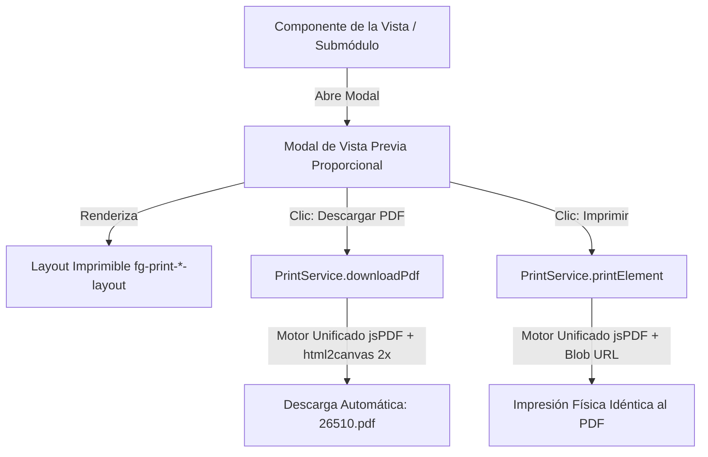

# SDD — Estándar de Generación, Descarga e Impresión de Comprobantes PDF (4Guard_FE_UI)

> **Módulo:** `core/print-engine`  
> **Repositorio:** `4Guard_FE_UI` · **Rama:** `develop`  
> **Framework:** Angular 17+ (Signals Reactivos, Standalone Components, jsPDF + html2canvas)  
> **Estado:** 🟢 Estándar Oficial Único para Todos los Módulos  

---

## 1. Objetivo y Directrices Generales

Este documento es la **guía única y estándar oficial** para implementar la generación, visualización previa, descarga directa e impresión física de comprobantes oficiales (Pautas de Recepción, Hojas de Cancelación, Traspasos, Despachos Outbound, Dictámenes de Calidad, Facturación, etc.) en cualquier módulo de **4GUARD WMS**.

### Directrices Obligatorias:
1. **Paridad Visual Absoluta (100%):** El documento impreso en papel físico y el archivo PDF descargado deben ser **idénticos** en tipografía, bordes, alineación y tablas (comparten el mismo motor de renderizado).
2. **Descarga Directa 1-Clic Nombrada por Folio:** Al hacer clic en *"Descargar PDF"*, el archivo se guarda automáticamente como `${folio}.pdf` (ej. `26510.pdf`, `TR-004.pdf`) sin abrir cuadros de diálogo del sistema operativo pidiendo nombre.
3. **Cero Textos Sobrantes en Impresión:** No deben aparecer URLs (`localhost`), fechas/horas ni paginación (`1/1`) en los márgenes de la hoja física.
4. **Modal en 1 Sola Fila y Proporción Carta:** La barra de acciones debe estar siempre en una sola línea continua (sin saltos verticales) y la hoja debe ser 100% visible al 100% de zoom de la pantalla sin requerir scroll forzado.

---

## 2. Arquitectura del Motor Unificado (`PrintService`)

El servicio singleton [`PrintService`](file:///c:/Users/lenovo/Documents/ProyectosSyborX/4Guard/4Guard_FE_UI/apps/admin-console/src/app/core/services/print.service.ts) centraliza la lógica de renderizado:



### Métodos del Servicio:

| Método | Parámetros | Descripción |
|---|---|---|
| `downloadPdf(target, filename)` | `target: HTMLElement \| string`, `filename: string` | Captura el nodo a 2x Retina DPI, crea el PDF y lo descarga como `${filename}.pdf`. |
| `printElement(target, documentTitle)` | `target: HTMLElement \| string`, `documentTitle: string` | Genera el PDF idéntico y lo envía a la impresora mediante un `iframe` aislado de la SPA. |

---

## 3. Guía de Implementación Paso a Paso (Para Crear un Nuevo Módulo)

### Paso 1: Inyectar `PrintService` y Signals en el Componente TypeScript

En el archivo `.component.ts` de la página:

```typescript
import { Component, inject, signal } from '@angular/core';
import { PrintService } from '../../../../core/services/print.service';
// Importar el layout imprimible específico del módulo
import { PrintMyFeatureLayoutComponent } from '../../components/print-layouts/print-my-feature-layout.component';

@Component({
  selector: 'fg-my-feature',
  standalone: true,
  imports: [CommonModule, PrintMyFeatureLayoutComponent],
  templateUrl: './my-feature.component.html'
})
export class MyFeatureComponent {
  private readonly printService = inject(PrintService);

  // Estados del modal
  readonly showPrintModal = signal<boolean>(false);
  readonly selectedItemToPrint = signal<MyEntity | null>(null);
  readonly isGeneratingPdf = signal<boolean>(false);

  openPrintPreview(item: MyEntity): void {
    this.selectedItemToPrint.set(item);
    this.showPrintModal.set(true);
  }

  closePrintModal(): void {
    this.showPrintModal.set(false);
    this.selectedItemToPrint.set(null);
  }

  // 1-Clic: Descarga del archivo PDF con el número de folio
  async downloadDirectPdf(): Promise<void> {
    const item = this.selectedItemToPrint();
    if (!item) return;

    const folio = item.folio || item.id || 'Doc';
    this.isGeneratingPdf.set(true);
    try {
      await this.printService.downloadPdf('fg-print-my-feature-layout', String(folio));
    } finally {
      this.isGeneratingPdf.set(false);
    }
  }

  // Impresión física idéntica
  triggerBrowserPrint(): void {
    const item = this.selectedItemToPrint();
    const folio = item?.folio || item?.id || 'Doc';
    this.printService.printElement('fg-print-my-feature-layout', String(folio));
  }
}
```

---

### Paso 2: Plantilla HTML del Modal (Una Sola Fila y Proporción Carta)

En el archivo `.component.html` de la página, añadir el modal con la cabecera en una sola fila (`flex-nowrap`):

```html
<!-- MODAL DE VISTA PREVIA E IMPRESIÓN OFICIAL -->
@if (showPrintModal() && selectedItemToPrint(); as item) {
  <div class="modal-overlay p-2 sm:p-4">
    <div class="modal-card max-w-3xl w-full p-3 sm:p-4 space-y-2.5 max-h-[96vh] flex flex-col overflow-hidden shadow-2xl bg-white dark:bg-slate-900 border border-slate-200 dark:border-slate-800">
      
      <!-- Barra Superior en UNA SOLA FILA -->
      <div class="flex items-center justify-between gap-3 no-print border-b border-slate-200 dark:border-slate-800 pb-2.5 flex-shrink-0">
        <div class="flex items-center gap-2 min-w-0">
          <span class="material-symbols-outlined text-amber-500 text-base shrink-0">print</span>
          <span class="font-black text-xs text-slate-800 dark:text-slate-100 uppercase tracking-wider truncate">
            Comprobante Oficial — {{ item.folio }}
          </span>
        </div>

        <div class="flex items-center gap-2 shrink-0">
          <!-- Botón 1-Clic Descarga Directa -->
          <button
            type="button"
            (click)="downloadDirectPdf()"
            [disabled]="isGeneratingPdf()"
            class="btn-primary-gold px-3.5 py-1.5 rounded-lg text-xs font-bold flex items-center gap-1.5 shadow-sm disabled:opacity-50 whitespace-nowrap text-slate-900 transition-all hover:scale-[1.02]"
          >
            <span class="material-symbols-outlined text-sm">download</span>
            <span>{{ isGeneratingPdf() ? 'Generando...' : 'Descargar PDF (' + (item.folio || 'Doc') + '.pdf)' }}</span>
          </button>
          
          <!-- Botón Impresión Física -->
          <button
            type="button"
            (click)="triggerBrowserPrint()"
            class="btn-secondary-outline px-3 py-1.5 rounded-lg text-xs font-bold flex items-center gap-1 whitespace-nowrap border border-slate-300 dark:border-slate-700"
          >
            <span class="material-symbols-outlined text-sm">print</span>
            <span>Imprimir</span>
          </button>
          
          <!-- Botón Cerrar -->
          <button
            type="button"
            (click)="closePrintModal()"
            class="btn-secondary-outline px-2.5 py-1.5 rounded-lg text-xs font-bold whitespace-nowrap"
          >
            Cerrar
          </button>
        </div>
      </div>

      <!-- Contenedor del Documento con Scroll Suave Interno si es necesario -->
      <div class="flex-1 overflow-y-auto pr-0.5">
        <fg-print-my-feature-layout [data]="item"></fg-print-my-feature-layout>
      </div>

    </div>
  </div>
}
```

---

### Paso 3: Componente Layout Imprimible (`print-my-feature-layout.component.ts`)

Crea el componente layout con proporciones esbeltas para que entre completo en hoja Carta:

```typescript
import { Component, Input } from '@angular/core';
import { CommonModule } from '@angular/common';

@Component({
  selector: 'fg-print-my-feature-layout',
  standalone: true,
  imports: [CommonModule],
  template: `
    <div *ngIf="data" class="print-container bg-white text-black p-4 sm:p-5 max-w-full mx-auto font-sans border border-slate-300 rounded-lg shadow-sm">
      
      <!-- 1. Encabezado Institucional -->
      <div class="flex justify-between items-start mb-2 pb-1.5 border-b border-black">
        <div class="flex items-center gap-2.5">
          
          <div>
            <h1 class="text-sm sm:text-base font-extrabold tracking-tight text-black">4-GUARD WMS</h1>
            <p class="text-[8px] sm:text-[9px] text-slate-600 font-semibold uppercase leading-tight">Industria Automotriz 128, Toluca de Lerdo, Méx</p>
          </div>
        </div>
        <div class="text-right">
          <p class="text-[9px] sm:text-[10px] font-mono font-bold text-slate-800">FECHA: {{ printDate }}</p>
        </div>
      </div>

      <!-- 2. Título Central del Documento -->
      <div class="text-center mb-2.5">
        <h2 class="text-xs sm:text-sm font-black uppercase tracking-wider text-black">DICTAMEN OFICIAL</h2>
      </div>

      <!-- 3. Metadatos en Rejilla Compacta -->
      <div class="grid grid-cols-2 gap-x-4 gap-y-1 text-[10px] sm:text-[11px] mb-3 bg-slate-50 p-2 border border-slate-200 rounded font-mono">
        <div><span class="font-bold">FOLIO:</span> #{{ data.folio }}</div>
        <div><span class="font-bold">FECHA:</span> {{ data.createdAt }}</div>
        <div><span class="font-bold">CLIENTE:</span> {{ data.client }}</div>
        <div><span class="font-bold">ESTADO:</span> {{ data.status }}</div>
      </div>

      <!-- 4. Tabla de Partidas -->
      <div class="mb-2.5 border border-black rounded-sm overflow-hidden">
        <table class="w-full text-left text-[9px] sm:text-[10px] border-collapse font-mono">
          <thead>
            <tr class="border-b border-black font-bold uppercase bg-slate-100">
              <th class="py-1 px-1.5 border-r border-black">Código</th>
              <th class="py-1 px-1.5 border-r border-black">Descripción</th>
              <th class="py-1 px-1.5 text-right">Cantidad</th>
            </tr>
          </thead>
          <tbody>
            <tr *ngFor="let item of data.items" class="border-b border-slate-200">
              <td class="py-0.5 px-1 border-r border-black font-bold">{{ item.code }}</td>
              <td class="py-0.5 px-1 border-r border-black">{{ item.description }}</td>
              <td class="py-0.5 px-1 text-right font-bold">{{ item.quantity }}</td>
            </tr>
          </tbody>
        </table>
      </div>

      <!-- 5. Firmas y Auditoría -->
      <div class="grid grid-cols-2 gap-8 items-end text-[10px] sm:text-[11px] font-mono pt-2 border-t border-slate-200 mt-3">
        <div>
          <p class="font-bold">RESPONSABLE: <span class="font-normal uppercase">{{ data.operatorName }}</span></p>
          <p class="text-[8px] text-slate-500 font-sans">Documento auditado oficial 4GUARD WMS</p>
        </div>
        <div class="text-center">
          <div class="border-b border-black w-full mb-1"></div>
          <p class="font-bold text-[9px] sm:text-[10px]">NOMBRE Y FIRMA</p>
        </div>
      </div>

    </div>
  `
})
export class PrintMyFeatureLayoutComponent {
  @Input() data!: any;

  get printDate(): string {
    const d = new Date();
    return `${d.getDate().toString().padStart(2, '0')}/${(d.getMonth() + 1).toString().padStart(2, '0')}/${d.getFullYear()}`;
  }
}
```

---

## 4. Reglas Críticas del Estándar

1. **Margen Cero en `@page`:**  
   En `styles.scss` la regla `@page { size: letter portrait; margin: 0 !important; }` es la que elimina los encabezados de localhost. Nunca modificar ni añadir márgenes a `@page`.
2. **Resolución Retina 2x:**  
   `PrintService` siempre usa `scale: 2` para que los PDFs queden con nitidez vectorial en códigos de barras y textos pequeños.
3. **Ancho `max-w-3xl` en el Modal:**  
   Evita que la barra de botones se fracture en múltiples líneas y encaja perfectamente en pantallas estándar.
