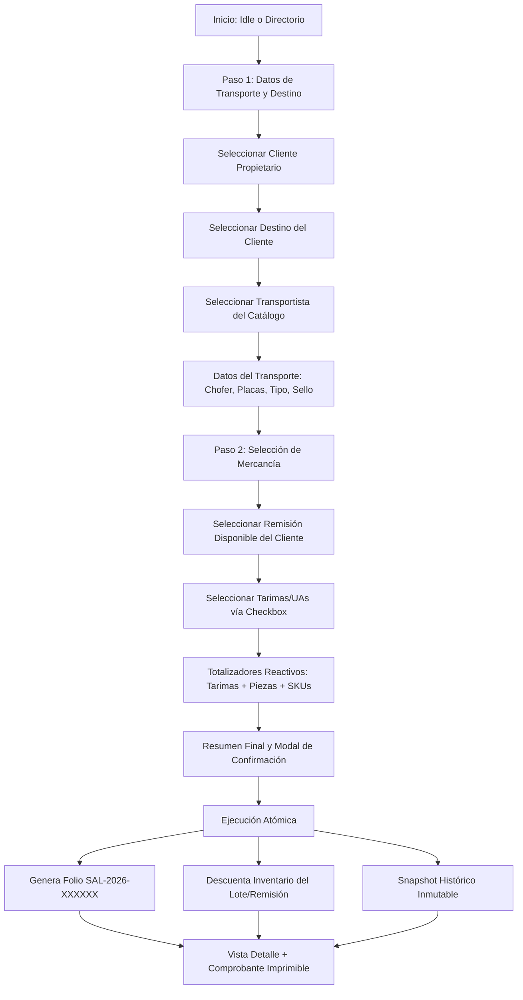

# SDD — Salida de Almacén (Despacho / Outbound)

**Proyecto:** 4GUARD WMS
**Módulo:** Operación y Logística → Movimientos de Almacén → Salida de Almacén
**Pantalla Legacy:** Entrega de Mercancía
**Tipo de Operación:** Transaccional de Despacho / Outbound FIFO·FEFO
**Estado:** Aprobado e Implementado (MVP1)
**Versión:** 1.0 (Arquitectura Master-Detail Unificada)
**Patrón:** Spec-Driven Development (SDD)
**Autor:** Equipo de Ingeniería 4GUARD / Synexia Framework

---

## 1. Objetivo

Implementar el módulo **Salida de Almacén** para registrar y controlar la salida física de mercancía del almacén con destino a un cliente, garantizando:

1. **Identificación completa de la operación:** Cliente, destino, transportista, vehículo, número de sello y operadores.
2. **Selección controlada de mercancía:** Selección granular de tarimas/UAs por remisión mediante checkbox con totalizadores reactivos.
3. **Integridad del Inventario:** Descuento atómico del inventario disponible en la bahía de origen al confirmar el despacho.
4. **Trazabilidad Integral:** Generación de folio correlativo único `SAL-YYYY-XXXXXX` y snapshot histórico inmutable.
5. **Comprobante Operativo Imprimible:** Formato oficial `SALIDA DE MERCANCÍA` con bloques de firma (Responsable Salida, Montacarguista, Transportista/Chofer, Supervisor).

La operación representa un **despacho físico real**, actualizando el estado lógico del inventario hacia `DISPATCHED (60)` según la FSM del WMS.

---

## 2. Arquitectura de la Interfaz (Master-Detail Workbench)

Homologada 1:1 con **Recepción de Mercancía** y **Cambio de Almacén**, sin sub-tabs redundantes:

### 2.1 Tarjetas KPI Superiores (4 Métricas en Tiempo Real)
| Ícono | KPI | Descripción |
|---|---|---|
| `local_shipping` | **Total Salidas** | Folios de despacho generados (`SAL-YYYY-XXXXXX`) |
| `inventory` | **Tarimas Despachadas** | Total acumulado de UAs enviadas al cliente |
| `groups` | **Clientes Atendidos** | Clientes distintos con al menos una salida registrada |
| `scale` | **Piezas Totales** | Cantidad acumulada de piezas despachadas |

### 2.2 Panel Izquierdo: Directorio Master de Salidas (4 Columnas)
* Buscador reactivo por Folio, Cliente, Transportista o Sello.
* Listado de tarjetas con: folio dorado, cliente, ruta `Destino`, sello y total de tarimas.
* Botón `+ Nueva Salida` (dorado institucional, parte superior del directorio).

### 2.3 Panel Derecho: Espacio de Trabajo Unificado (8 Columnas)
Opera en tres modos controlados por `formMode: 'idle' | 'create' | 'detail'`:

1. **`idle`** — Tarjeta "Sin selección" con botón central `+ Nueva Salida de Almacén`.
2. **`create`** — Formulario transaccional de 2 pasos (Transporte/Destino → Mercancía/Tarimas) con progreso visual.
3. **`detail`** — Vista histórica de solo lectura con comprobante imprimible.

---

## 3. Flujo Operativo Transaccional (2 Pasos MVP1)



---

## 4. Modelo de Datos y Contratos TypeScript

### 4.1 Entidad Principal: `WarehouseOutbound`
```typescript
export type OutboundStatus = 'COMPLETED' | 'CANCELLED';
export type TransportType = 'CAMION' | 'TORTON' | 'TRAILER';

export interface WarehouseOutbound {
  id: string;                          // Identificador interno único
  folio: string;                       // Folio oficial: 'SAL-YYYY-XXXXXX'
  status: OutboundStatus;

  // ── Cliente / Destino (Snapshot) ──
  clientCode: string;                  // UUID del cliente (ej. 'a07281f9-3d2b-42f3-a756-11f869a8b123')
  clientName: string;                  // Snapshot: 'MARCAS NESTLE S.A. DE C.V.'
  destinationId: string;               // UUID del destino (ej. 'b9c6beee-1e5b-4e3c-8e46-32f0390bf0df')
  destinationName: string;             // Snapshot: 'CENTRO DE NEGOCIO PAC'
  destinationAddress?: string;         // Snapshot dirección completa

  // ── Transportista / Vehículo (Snapshot) ──
  carrierCode: string;                 // UUID del transportista (ej. 'f1a9b2c3-4d5e-6f7a-8b9c-0d1e2f3a4b5c')
  carrierName: string;                 // Snapshot: 'TRANSPORTADORA GOLA S.A. DE C.V.'
  driverName: string;                  // Nombre del Chofer
  economicNumber: string;              // Número económico del tractocamión
  tractorPlates: string;               // Placas del Tracto
  boxPlates: string;                   // Placas de la Caja
  transportType: TransportType;        // 'CAMION' | 'TORTON' | 'TRAILER'
  sealNumber: string;                  // Número de Sello / Cincho (OBLIGATORIO)

  // ── Mercancía ──
  remisionNo: string;                  // Remisión asociada al despacho
  items: OutboundItem[];               // Tarimas/UAs despachadas
  totalPallets: number;                // Total de UAs despachadas
  totalPieces: number;                 // Suma de piezas
  distinctSkus: number;                // Número de SKUs únicos

  // ── Auditoría ──
  dispatchedAt: string;                // Fecha y hora de despacho
  dispatchedBy: string;                // Usuario administrativo emisor
  timestamp: string;                   // HH:mm para la tarjeta del directorio
}
```

### 4.2 Entidad de Detalle: `OutboundItem`
```typescript
export interface OutboundItem {
  id: string;
  palletCode: string;                  // Código UA / SSCC (ej. 'UA-8810-1')
  productId: string;                   // SKU
  description: string;                 // Descripción del producto
  lotNumber: string;                   // Lote de fabricación
  expirationDate: string;              // Fecha de caducidad
  pieces: number;                      // Piezas en la tarima
  palletTypeId: string;                // Tipo de tarima
  palletTypeLabel: string;
  locationCode?: string;               // Bahía de origen
}
```

### 4.3 Destinos por Cliente: `ClientDestination`
```typescript
export interface ClientDestination {
  id: string;                          // Ej. 'b9c6beee-1e5b-4e3c-8e46-32f0390bf0df'
  clientCode: string;                  // Referencia al cliente
  name: string;                        // Ej. 'CENTRO DE NEGOCIO PAC'
  address: string;                     // Dirección completa
  city: string;
  state: string;
  contactName?: string;
  contactPhone?: string;
  status: 'ACTIVO' | 'INACTIVO';
}
```

### 4.4 Catálogos de Apoyo
```typescript
export const TRANSPORT_TYPES: { id: TransportType; label: string }[] = [
  { id: 'CAMION',  label: 'Camión' },
  { id: 'TORTON',  label: 'Tórtón' },
  { id: 'TRAILER', label: 'Tráiler' },
];

export const CLIENT_DESTINATIONS: ClientDestination[] = [
  { id: 'b9c6beee-1e5b-4e3c-8e46-32f0390bf0df', clientCode: 'c9b4e182-7d3f-4e91-8845-a4b5c6d7e8f9', name: 'CENTRO DE NEGOCIO PAC', address: 'Planta Nestlé PAC', city: 'Toluca', state: 'Estado de México', status: 'ACTIVO' },
  { id: 'e2a4b891-3c7d-4f1e-9a52-78d1f046b9a2', clientCode: 'c9b4e182-7d3f-4e91-8845-a4b5c6d7e8f9', name: 'CENTRO DE NEGOCIO CULINARIOS', address: 'Planta Culinarios Nestlé', city: 'Toluca', state: 'Estado de México', status: 'ACTIVO' },
  { id: 'f47ac10b-58cc-4372-a567-0e02b2c3d479', clientCode: 'c9b4e182-7d3f-4e91-8845-a4b5c6d7e8f9', name: 'CENTRO DE NEGOCIO CAFES', address: 'Planta Cafés Nestlé', city: 'Toluca', state: 'Estado de México', status: 'ACTIVO' },
  { id: '6ba7b810-9dad-41d1-80b4-00c04fd430c8', clientCode: 'c9b4e182-7d3f-4e91-8845-a4b5c6d7e8f9', name: 'CENTRO DE NEGOCIO CAF', address: 'Planta Nestlé CAF', city: 'Toluca', state: 'Estado de México', status: 'ACTIVO' },
  { id: '550e8400-e29b-41d4-a716-446655440000', clientCode: 'c9b4e182-7d3f-4e91-8845-a4b5c6d7e8f9', name: 'CENTRO DE NEGOCIO CHOCOLATES', address: 'Planta Chocolates Nestlé', city: 'Toluca', state: 'Estado de México', status: 'ACTIVO' },
  { id: '9b1deb4d-3b7d-4bad-9bdd-2b0d7b3dcb6d', clientCode: 'c9b4e182-7d3f-4e91-8845-a4b5c6d7e8f9', name: 'CENTRO DE NEGOCIO CAFÉ VERDE', address: 'Planta Nestlé Café Verde', city: 'Toluca', state: 'Estado de México', status: 'ACTIVO' },
];
```

---

## 5. Reglas de Negocio (RN)

| Código | Regla |
|---|---|
| **RN-001** | Cliente Propietario obligatorio — selector del catálogo activo. |
| **RN-002** | Destino Físico / Planta obligatorio — selector del catálogo integral de destinos (desacoplado de la selección de cliente para máxima flexibilidad operativa en andén). |
| **RN-003** | Transportista obligatorio — del catálogo institucional activo. |
| **RN-004** | Número de sello (cincho) obligatorio en todo despacho. |
| **RN-005** | Al menos 1 tarima/UA debe ser seleccionada para registrar la salida. |
| **RN-006** | Los datos del transporte se conservan como **snapshot inmutable** en el histórico. |
| **RN-007** | El despacho descuenta de forma atómica las UAs del lote/remisión de inventario. |
| **RN-008** | Toda salida genera folio único `SAL-YYYY-XXXXXX` — no reutilizable. |
| **RN-009** | Una tarima despachada no puede volver a seleccionarse en otra salida activa. |
| **RN-010** | El Backend debe revalidar la disponibilidad al confirmar (control de concurrencia). |
| **RN-011** | La cancelación es operación excepcional — solo SUPER_ADMIN con motivo obligatorio. |
| **RN-012** | Toda reimpresión es de solo lectura — no genera nuevo folio ni modifica inventario. |
| **RN-013** | El folio del comprobante imprimible es siempre el folio original — inmutable. |
| **RN-014** | Los registros históricos no deben eliminarse físicamente (soft-delete / status change). |
| **RN-015** | La operación genera registro en `inventory_movements` tipo `DISPATCH/OUTBOUND`. |

---

## 6. Especificación del Comprobante Imprimible (SALIDA DE MERCANCÍA)

```
┌────────────────────────────────────────────────────────────────────┐
│  [LOGO 4GUARD]            SALIDA DE MERCANCÍA              [FOLIO] │
│  Almacén Central                                         SAL-2026  │
│  4GUARD WMS                                             -000001   │
├────────────────────────────────────────────────────────────────────┤
│ FECHA / HORA   │ USUARIO EMISOR       │ ESTADO: COMPLETADO         │
├────────────────────────────────────────────────────────────────────┤
│ CLIENTE        │ DESTINO                                           │
│ Nestlé México  │ CEDIS Toluca — Blvd. Aeropuerto 2112              │
├────────────────────────────────────────────────────────────────────┤
│ TRANSPORTISTA  │ CHOFER         │ ECO.   │ SELLO                   │
│ Transp. Castores│ Juan Pérez    │ ECO-901│ SL-88401                │
│ TRACTO: 12-AA-34│ CAJA: 78-BB-90│ TIPO: Tráiler                   │
├────────────────────────────────────────────────────────────────────┤
│ REMISIÓN: REM-88102                                                │
├────────────────────────────────────────────────────────────────────┤
│ UA/SSCC     │ SKU          │ DESCRIPCIÓN         │ LOTE  │ PIEZAS  │
│ UA-8810-1   │ SKU-NES-680  │ Cereal Nesquik 680g │ LOT-A1│ 480 pz  │
│ UA-8810-2   │ SKU-NES-680  │ Cereal Nesquik 680g │ LOT-A1│ 480 pz  │
├────────────────────────────────────────────────────────────────────┤
│ TOTAL: 2 Tarimas │ 960 Piezas │ 1 SKU Distinto                    │
├────────────────────────────────────────────────────────────────────┤
│ FIRMA RESPONSABLE │ FIRMA MONTACARGUISTA │ FIRMA TRANSPORTISTA     │
│                   │                      │                         │
│ _________________ │ ____________________ │ _____________________   │
│ FIRMA SUPERVISOR                                                   │
│ _________________________                                          │
└────────────────────────────────────────────────────────────────────┘
```

---

## 7. Criterios de Aceptación (CA)

| Código | Criterio de Aceptación | Estado |
|---|---|:---:|
| **CA-001** | La pantalla carga en arquitectura Master-Detail con 4 KPIs horizontales | ✅ |
| **CA-002** | El estado inicial muestra tarjeta "Sin selección" con botón `+ Nueva Salida` | ✅ |
| **CA-003** | Paso 1: Selector de cliente activa destinos filtrados del catálogo del cliente | ✅ |
| **CA-004** | Paso 1: Selector de transportista precarga nombre del catálogo | ✅ |
| **CA-005** | Paso 1: Campo sello es obligatorio con validación visual | ✅ |
| **CA-006** | Paso 2: Selector de remisión carga lotes/tarimas disponibles del cliente | ✅ |
| **CA-007** | Paso 2: Selección granular de tarimas vía checkbox | ✅ |
| **CA-008** | Paso 2: Botón "Seleccionar Todas" funciona correctamente | ✅ |
| **CA-009** | Totalizadores (Tarimas / Piezas / SKUs) se actualizan en tiempo real | ✅ |
| **CA-010** | Botón "Confirmar Despacho" se deshabilita si faltan validaciones | ✅ |
| **CA-011** | Modal de confirmación tiene fondo sólido opaco y alto contraste | ✅ |
| **CA-012** | Ejecución genera folio `SAL-2026-XXXXXX` y descuenta inventario del lote | ✅ |
| **CA-013** | Comprobante imprimible incluye todos los datos del despacho y 4 bloques de firma | ✅ |
| **CA-014** | Nuevo folio aparece en el directorio izquierdo con badge de estado | ✅ |
| **CA-015** | Seleccionar folio del directorio activa modo detalle read-only con sección de Control & Auditoría | ✅ |
| **CA-016** | Persistencia en LocalStorage — workbench sobrevive recarga | ✅ |
| **CA-017** | Tipografía: `Outfit`, `Inter`, `JetBrains Mono`. Colores: Midnight Navy & Prestige Gold y Dark Mode | ✅ |
| **CA-018** | Botón `+ Nuevo` solo existe en el directorio (no duplicado en breadcrumb) | ✅ |

---

## 8. Control y Auditoría Homologada

En el modo detalle (`formMode === 'detail'`), se despliega la sección **"Información de Control & Auditoría"** homologada con el estándar WMS:
1. **Metadatos Rápidos:** Grid de 4 columnas con Folio de Despacho, Organización (`4GUARD LOGISTICS CORP`), Registrado Por (`@usuario`), Fecha de Operación.
2. **Línea de Tiempo Interactiva:** Registro cronológico de eventos con nodos codificados por color:
   * `SALIDA_REGISTRADA` (Verde Esmeralda `.carriers-tl-node--emerald`): Registro de despacho con cliente, destino, transportista, sello y total de piezas.
   * `SALIDA_DESPACHADA` (Azul `.carriers-tl-node--blue`): Confirmación de salida física del almacén y tránsito.
   * `SALIDA_CANCELADA` (Rojo `.carriers-tl-node--red`): Revocación con motivo y autorizador.

---

## 9. Dependencias y Pendientes (MVP2)

### Catálogos Usados en MVP1 (Simulados con Seed Data)
- **Transportistas** → `carrierLinesSignal` existente en `WarehouseMovementsService`.
- **Clientes** → `clientsSignal` existente en `WarehouseMovementsService`.
- **Destinos por Cliente** → `CLIENT_DESTINATIONS` en `warehouse-movements.models.ts`.
- **Remisiones/Lotes** → `inventoryBatchesSignal` existente en `WarehouseMovementsService`.
- **Salidas** → `outboundsSignal` nuevo en `WarehouseMovementsService` (LocalStorage: `'4guard_outbounds'`).

### Pendientes MVP2
- `client_destinations` real en base de datos (relación `clients → client_destinations`).
- Entidad `remissions` independiente con relación a `inventory_items`.
- Integración de FSM oficial (`AVAILABLE → PICKED → DISPATCHED`).
- Validación de concurrencia con `version` en `inventory_items`.
- Idempotency key en endpoint de registro.
- Cancelación con reautenticación SUPER_ADMIN.
- ADR: ¿Salida directa o requiere Orden de Salida previa?

---

## 10. Definition of Done (MVP1)

- [x] SDD documentado y aprobado.
- [x] Modelos TypeScript `WarehouseOutbound`, `OutboundItem`, `ClientDestination`, `MovementAuditEntry` implementados.
- [x] Service: `outboundsSignal`, `executeOutbound()`, KPIs computados, auditoría reactiva.
- [x] Componente: `formMode` tri-estado, Paso 1, Paso 2, modal, detalle con sección de Auditoría.
- [x] CSS homologado 1:1 con `carrier-management.component.css` y `transfer-submodule.component.css`.
- [x] Comprobante imprimible con 4 bloques de firma.
- [x] Build sin errores TypeScript (`tsc --noEmit` exit 0).
- [x] Funciona en `/warehouse-movements/outbound`.

---

## 11. Contratos Backend REST (Spring Boot — `/api/v1/warehouse-outbounds`)

| Método | Endpoint | DTO / Payload | Descripción |
|---|---|---|---|
| `POST` | `/` | `CreateOutboundRequest` | Registrar salida / despacho outbound y descontar inventario atómicamente |
| `GET` | `/{id}` | N/A | Consulta de detalle con tarimas despachadas |
| `GET` | `/` | Query params: `organizationId`, `branchId`, `status`, `search` | Consulta de listado master con KPIs y filtros |
| `POST` | `/{id}/cancel` | `CancelOutboundRequest` | Cancelación de salida y restauración de inventario con reautenticación Admin |
| `GET` | `/inventory-batches` | Query params: `organizationId`, `branchId`, `clientId`, `skuId`, `search` | Consulta de lotes disponibles con sugerencia FEFO indexada |
| `GET` | `/scan-pallet` | Query params: `barcode`, `organizationId`, `branchId` | Búsqueda rápida sub-10ms por SSCC o código de barras de tarima para escáner RF |
| `POST` | `/validate-pallets` | `ValidatePalletsRequest` | Validación masiva de lote de códigos de barras / SSCCs |
| `GET` | `/{id}/audit` | N/A | Historial de auditoría cronológica |


